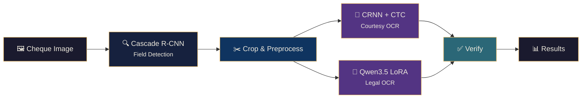
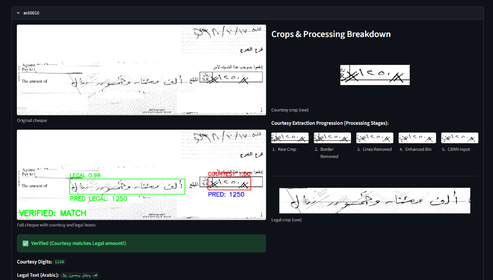
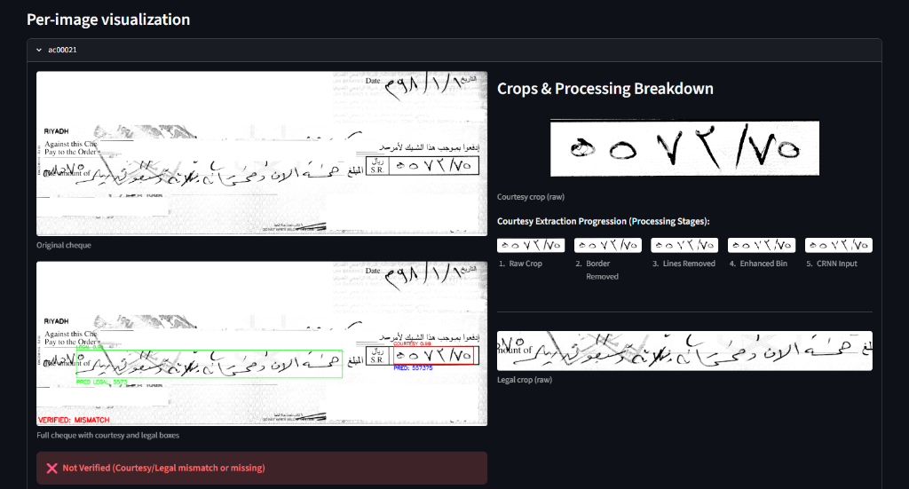

<p align="center">
  <strong>Arabic Cheque OCR &amp; Verification Pipeline</strong>
</p>

<p align="center">
  End-to-end field localization, courtesy &amp; legal amount recognition, and cross-verification<br/>
  for Arabic bank cheques — deployed serverlessly on Modal.
</p>

<p align="center">
  <a href="https://redfries--arabic-cheque-ocr-run.modal.run"></a>
  <a href="https://github.com/redfries/arabic-cheque-ocr"></a>
  
  
</p>

---

## ✨ Live Demo

> **Try it now →** [redfries--arabic-cheque-ocr-run.modal.run](https://redfries--arabic-cheque-ocr-run.modal.run)
>
> Upload a cheque image or select a built-in sample. The pipeline runs detection, OCR, and verification end-to-end on a GPU-backed Modal container.

---

## Architecture

The system is a **unified three-stage pipeline** — detection, recognition, and verification — running inside a single GPU container.



| Stage | Component | Description |
|:------|:----------|:------------|
| **Part A** | Cascade R-CNN (ResNet-50 + FPN) | Localizes exactly one courtesy box and one legal box per cheque |
| **Part B — Courtesy** | CRNN + CTC | Transcribes cropped courtesy digits (Arabic-Indic → standard) |
| **Part B — Legal** | Qwen3.5-0.8B + LoRA | Reads handwritten Arabic legal amount text via vision-language model |
| **Verification** | Rule-based parser + fallback | Converts Arabic text → number, cross-checks with courtesy digits |

---

## Metrics

### Part A — Field Detection

Evaluated on our validation split (177 images):

| Metric | Overall | Courtesy | Legal |
|:-------|--------:|---------:|------:|
| **Mean IoU** | 80.21% | 80.18% | 80.25% |
| **Acc @ IoU ≥ 0.50** | 97.46% | 96.61% | 98.31% |
| **Acc @ IoU ≥ 0.75** | 73.73% | 75.71% | 71.75% |

### Part B — Courtesy Amount OCR

Evaluated on professor test set (598 samples), selected checkpoint `v1_last`:

| Digit Accuracy | Exact Match | Insertions | Deletions | Substitutions |
|---------------:|------------:|-----------:|----------:|--------------:|
| **96.65%** | **87.79%** | 26 | 42 | 19 |

### Part B — Legal Amount OCR

Fine-tuned **Qwen3.5-0.8B** with LoRA adapter. Features:
- Arabic-to-number parser with Levenshtein edit-distance recovery
- Courtesy-guided image enhancement fallback on mismatch
- Border cleanup, auto-contrast, and white padding variants

---

## Screenshots

<p align="center">
  
  <br/><em>Verified Case — Bounding boxes, cropped steps, and matching courtesy/legal values</em>
</p>

<p align="center">
  
  <br/><em>Not Verified Case — Flagging a discrepancy between OCR digits and parsed legal text</em>
</p>

---

## Directory Structure

```text
arabic-cheque-ocr/
├── README.md
├── requirements.txt
├── pipeline_core.py          # Core pipeline (detection, OCR, verification)
├── app_streamlit.py          # Streamlit web application
├── run_cheque_pipeline.py    # CLI for batch processing
├── modal_app.py              # Modal.com serverless deployment
├── eval_iou_metrics.py       # IoU evaluation metrics (Part A)
├── setup_models.py           # Model symlink helper
├── main.py                   # Label Studio data downloader
├── docs/
│   ├── OCR report.md         # Detailed project report
│   └── screenshots/          # App screenshots
├── notebooks/
│   ├── part_A.ipynb          # Part A: Detector training notebook
│   └── part_B.ipynb          # Part B: OCR training notebook
├── sample_images/            # 25 sample cheque TIFFs for demo
└── models/                   # [GIT-IGNORED] Model weights
    ├── detector/
    │   └── model_final.pth
    └── ocr/
        ├── crnn_ctc_v1/
        │   └── checkpoints/last.pt
        └── legal/            # Qwen3.5 LoRA adapter weights
```

---

## Local Setup

### Prerequisites

- Python 3.11 (recommended)
- CUDA-capable GPU (for Qwen3.5 inference)

### Installation

```bash
# Clone the repository
git clone https://github.com/redfries/arabic-cheque-ocr.git
cd arabic-cheque-ocr

# Install dependencies
pip install -r requirements.txt

# Install Detectron2 (build from source)
pip install 'setuptools<70'
pip install 'git+https://github.com/facebookresearch/detectron2.git'

# Set up model symlinks (Lightning.ai studio)
python setup_models.py
```

---

## Usage

### CLI — Batch Processing

```bash
python run_cheque_pipeline.py \
  --input /path/to/images \
  --out /path/to/output \
  --det-thresh 0.30 \
  --pad-frac 0.04
```

**Outputs:** `predictions.csv`, `predictions.txt`, `run_summary.json`, `overlays/`, `crops/`, `stages/`

### Streamlit — Interactive Web UI

```bash
streamlit run app_streamlit.py --server.address 0.0.0.0 --server.port 8501
```

### Modal — Cloud Deployment

```bash
# Install and authenticate
pip install modal
modal setup

# Create volume and upload model weights
modal volume create cheque-ocr-models
modal volume put cheque-ocr-models models/detector /detector
modal volume put cheque-ocr-models models/Qwen3.5_model /Qwen3.5_model

# Deploy
modal deploy modal_app.py
```

The app will be available at the URL Modal provides (currently live at [redfries--arabic-cheque-ocr-run.modal.run](https://redfries--arabic-cheque-ocr-run.modal.run)).

---

## Tech Stack

| Layer | Technology |
|:------|:-----------|
| **Detection** | Detectron2 · Cascade R-CNN · ResNet-50 + FPN |
| **Courtesy OCR** | Custom CRNN + BiLSTM + CTC (PyTorch) |
| **Legal OCR** | Qwen3.5-0.8B Vision-Language + LoRA (PEFT) |
| **Preprocessing** | OpenCV · Pillow · CLAHE · Morphological ops |
| **Web UI** | Streamlit |
| **Deployment** | Modal.com (A10G GPU, serverless) |
| **Training** | PyTorch · Transformers · Hugging Face |

---

## Acknowledgements

This project was developed as a **Master's term project** at **King Fahd University of Petroleum and Minerals (KFUPM)**.

---

<p align="center">
  <sub>Built with ❤️ by <a href="https://infinitys.me">Shabaaz Hussain</a></sub>
</p>
