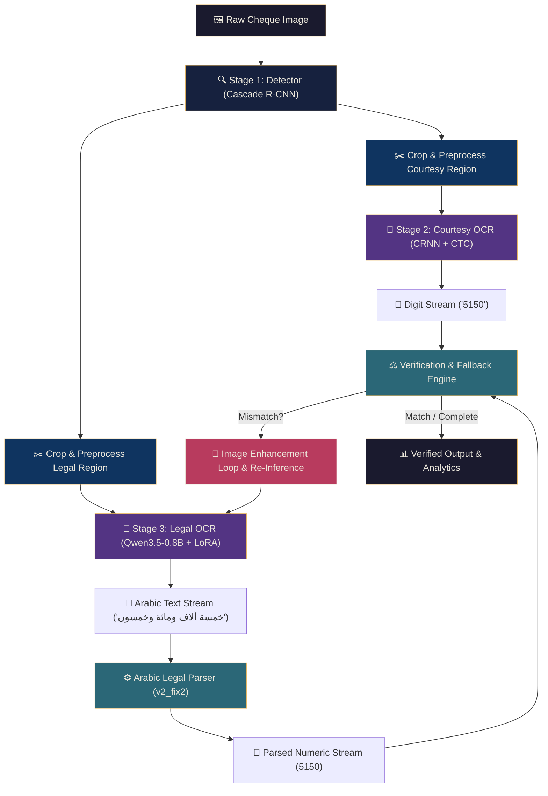

# Behind the Screen: Unifying Three Deep Learning Models into a Self-Verifying Arabic Cheque OCR Pipeline

*Author: Shabaaz Hussain (KFUPM Master's Project)*

Building an automated pipeline to process bank cheques is a classic, multi-faceted problem in computer vision. It is deceptively simple: find the amount fields, read them, and check if they match. 

But when the language is **Arabic**, the difficulty spikes exponentially. You are forced to deal with two completely different writing systems on the same document:
1. **Courtesy Amounts**: Numeric digits written in the Eastern Arabic-Indic numerals (`٠`, `١`, `٢`, `٣`...).
2. **Legal Amounts**: Complex, cursive, handwritten Arabic text representing the amount in words (e.g., `"خمسة آلاف ومائة وخمسون ريال"`).

To conquer this, we had to combine three distinct deep learning architectures, handle dependency chaos, clean up heavily textured crops, build an Arabic grammar-aware parser from scratch, and deploy the entire solution on serverless GPU infrastructure. 

This is the technical story of how we made them work together in a single, unified pipeline.

---

## The System Architecture

Before diving into the integration details, let's look at the three core "workers" in our pipeline:



---

## Step 1: The Gatekeeper — Field Detection (Cascade R-CNN)

The pipeline starts with a **Cascade R-CNN (ResNet-50 + FPN)** detector implemented via Facebook’s **Detectron2** framework. 

Cheques are filled with distracting visual elements: stamps, signatures, bank logos, background security patterns (guilloche prints), and table borders. If you pass the raw image to an OCR engine, the background noise ruins the transcription accuracy. The detector acts as the gatekeeper. It is trained to localize exactly two critical bounding boxes:
- **Class 0 (Courtesy Box)**: The rectangular box holding the digits.
- **Class 1 (Legal Box)**: The horizontal box containing the written Arabic text.

### The Integration Challenge: Sub-Pixel Scaling
When the detector outputs boxes, they are often tightly cropped around the characters. If a digit touches the bounding box boundary, the OCR model will misidentify it. To solve this, we implemented dynamic padding inside the pipeline.
We expand the boxes using a custom coordinate-clipping routine (`clip_xyxy`) and a percentage padding multiplier (`pad_frac`):

```python
# Crop courtesy with pad scaling
x1, y1, x2, y2 = courtesy_box
bw = x2 - x1
bh = y2 - y1
x1 -= pad_frac * bw
x2 += pad_frac * bw
y1 -= pad_frac * bh
y2 += pad_frac * bh
x1i, y1i, x2i, y2i = clip_xyxy(x1, y1, x2, y2, ImageWidth, ImageHeight)
```

---

## Step 2: The Fast Reader — Courtesy OCR (CRNN + CTC)

Once the courtesy box is cropped, it is passed to a custom **CRNN** (Convolutional Recurrent Neural Network) + **CTC** (Connectionist Temporal Classification Loss) model. 

### Preprocessing the Crop
Because digits on cheques are often written on top of dotted guidelines or surrounded by border lines, the crop needs aggressive cleaning before it hits the neural network. The pipeline runs the crop through a multi-stage preprocessing chain:
1. **Border Whitening**: Automatically sets the outermost $3\%$ pixels of the crop to solid white to wipe out bounding box lines.
2. **Horizontal/Vertical Line Removal**: Employs morphological operations (opening with narrow rectangular kernels) to identify and erase long straight lines (like the cheque guidelines) while leaving the handwriting intact.
3. **CLAHE & Median Blur**: Locally normalizes contrast and eliminates high-frequency noise.
4. **Aspect-Ratio Preserving Resize**: Standardizes the crop height to $48\text{px}$ while dynamically scaling the width to keep the digits legible.

```python
# Inside pipeline_core.py: remove_long_lines
hlines = cv2.morphologyEx(mask, cv2.MORPH_OPEN, h_kernel)
vlines = cv2.morphologyEx(mask, cv2.MORPH_OPEN, v_kernel)
lines = cv2.bitwise_or(hlines, vlines)
out[lines > 0] = 255  # Replace detected background lines with pure white
```

### Model Prediction
The custom CRNN architecture uses a Deep ResNet-based convolutional encoder, projects the 2D feature map to a 1D horizontal sequence, passes it through bidirectional LSTM recurrent layers, and predicts character classes using CTC greedy decoding.
The text output (which may contain Eastern Arabic-Indic characters like `١٢٥٠`) is normalized to standard Western Arabic numerals (`1250`) for mathematical matching.

---

## Step 3: The Semantic Engine — Legal OCR (Qwen3.5 + LoRA)

Reading handwritten cursive Arabic is notoriously difficult. Unlike digits, Arabic words have context-dependent letter shapes, ligatures, and overlapping strokes. Traditional CRNN models struggle with the high variance of Arabic handwriting.

To solve this, we integrated **Qwen3.5-0.8B Vision-Language Model** and fine-tuned it using **LoRA (Low-Rank Adaptation)** on huggingface’s PEFT framework. 

We feed the cropped legal amount region into Qwen3.5 with a dedicated prompt:
> `"استخرج نص المبلغ العربي المكتوب بخط اليد فقط. أعد النص فقط."`
> *(Extract the handwritten Arabic amount text only. Return the text only.)*

The LoRA adapter modifies the attention weights of the vision-language model, steering it to ignore stamps and logos in the crop and focus entirely on transcribing the literal Arabic currency tokens.

---

## Step 4: The Translator — Arabic Legal Amount Parser

The Qwen3.5 model yields text: `""خمسة آلاف ومائة وخمسون""`. 
To verify this against the courtesy digits (`5150`), we built a custom rule-based semantic parser. The parser performs four main steps:

1. **Normalization**: Strips Arabic diacritics (harakat), tatweel (elongation lines), and normalizes different forms of Alif (`أ`, `إ`, `آ` $\rightarrow$ `ا`) and Yaa (`ى`, `ئ` $\rightarrow$ `ي`).
2. **Levenshtein Edit-Distance Recovery**: Handwriting OCR frequently outputs minor spelling errors (e.g. `ثلاثة` transcribed as `ثلاته`). The parser matches unrecognized tokens against a dictionary of ~60 known Arabic number words using a length-adaptive edit-distance threshold. If the edit distance is within bounds, it automatically corrects the word.
3. **Compound Word Splitting**: Handles merged handwriting like `عشرالف` by splitting it into `عشرة` and `الف`.
4. **Semantic Evaluation**: Traverses the cleaned words left-to-right, accumulating values based on multipliers (like `الف` $\rightarrow 1000$ and `مليون` $\rightarrow 1000000$) to evaluate the final sum:
   $$\text{"خمسة"} (5) \times \text{"آلاف"} (1000) + \text{"مائة"} (100) + \text{"خمسون"} (50) = 5150$$

---

## Step 5: The Cross-Verification & Fallback Loop

This is where the unified pipeline design shines. Instead of running the models as isolated siloes, they cooperate.

When a cheque is processed:
1. The **Courtesy OCR** reads the digits (e.g., `5150`).
2. The **Legal OCR** reads the text and parses it (e.g., `5150`).
3. The pipeline checks: `courtesy_amount == legal_parsed_amount`.

If they match, the transaction is marked as `VERIFIED` and the pipeline terminates. 

### But what if they don't match?
If there is a mismatch, it is usually because the legal crop was too noisy or cropped too closely for the large vision model. Instead of giving up, the pipeline triggers an **Enhancement Fallback Loop**:
1. **Fallback 1 (Outer Border Whitening + Padding)**: The crop is padded with a solid white border, and standard Pillow contrast/sharpness autolevels are applied. This acts like a virtual magnifier, pushing background artifacts away from the model's focus.
2. **Fallback 2 (Autocontrast + Padding)**: Applies strong histogram equalization.
3. The pipeline feeds these enhanced crops back into Qwen3.5-0.8B LoRA.
4. If either fallback returns a value that matches the courtesy digits, the mismatch is resolved, the status is corrected to `VERIFIED`, and the details are logged.

This self-correcting feedback loop increased end-to-end verification robustness significantly, catching edge cases where minor lighting changes or boundary lines threw off the base model.

---

## Serverless Orchestration on Modal.com

Running three deep learning models together (especially a GPU-intensive Vision-Language model like Qwen3.5) on a standard server is slow and expensive. 

We migrated the unified pipeline to **Modal.com** to run serverlessly. The deployment setup solved two major system engineering hurdles:

### 1. Unified Environment & Shared Container
Detectron2 requires custom compiled C++ libraries matching the specific PyTorch and CUDA versions. HuggingFace PEFT and Qwen VL utilities require modern Python dependency stacks. 
We defined a custom Modal container image that pre-builds these elements from scratch, including pinning `setuptools<70` to prevent setup script failures in older Detectron2 source files:

```python
image = (
    modal.Image.debian_slim(python_version="3.11")
    .pip_install("setuptools<70")
    .run_commands(
        "apt-get update && apt-get install -y git build-essential libgl1-mesa-glx libglib2.0-0"
    )
    .pip_install(
        "torch==2.1.2",
        "torchvision==0.16.2",
        "index-url=https://download.pytorch.org/whl/cu121"
    )
    .run_commands(
        "python -m pip install 'git+https://github.com/facebookresearch/detectron2.git'"
    )
    .pip_install("transformers", "peft", "qwen-vl-utils", "streamlit", "opencv-python")
)
```

### 2. GPU-Backed Persistent Mounts
Instead of downloading the heavy model weights ($2.2\text{GB}$ total) during cold starts, we created a persistent network volume (`cheque-ocr-models`) on Modal. The weights are uploaded once and mounted directly to `/root/models` at runtime. 
When a request comes in, Modal spins up a container, attaches an **NVIDIA A10G GPU**, mounts the models, and executes the entire pipeline in under **2.5 seconds** per cheque.

---

## Conclusion

By wrapping Cascade R-CNN, CRNN+CTC, and Qwen3.5 LoRA into a single script, we turned what could have been a fragmented system into a clean, cohesive pipeline. The custom edit-distance parsing logic bridges the gap between human language and digits, and the verification loop gives the system the ability to double-check its own work.

The final app is live at [redfries--arabic-cheque-ocr-run.modal.run](https://redfries--arabic-cheque-ocr-run.modal.run), serving as a fast, reliable demonstration of modern AI applied to document verification.
